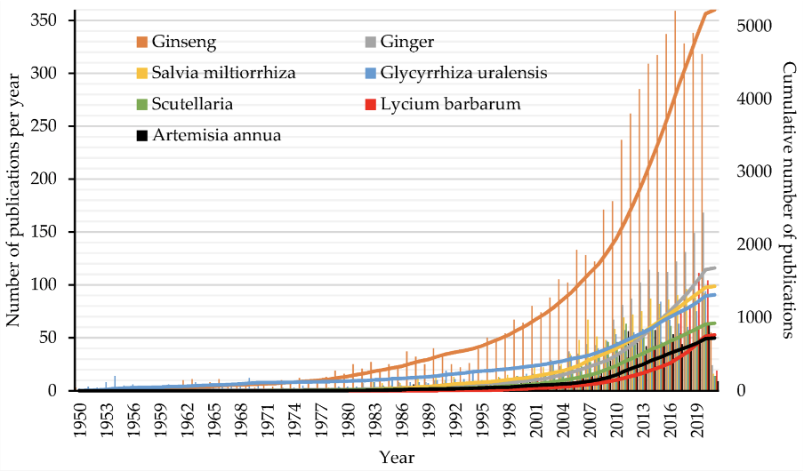
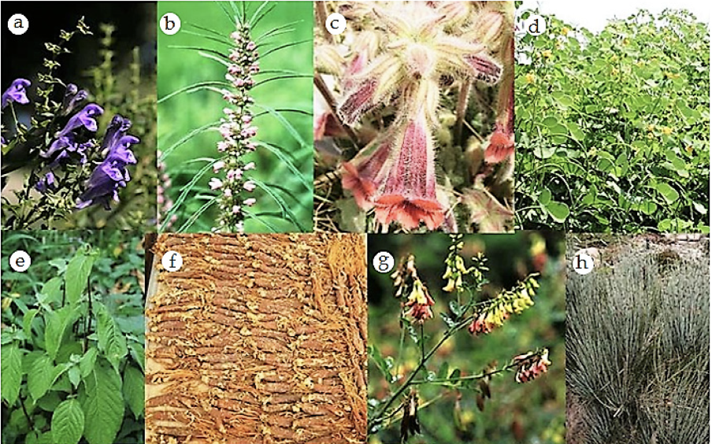

## Introduction to Traditional Herbal Medicine
### Traditional Herbal Medicine is Useful and Popular

Traditional herbal medicine is one of the oldest forms of alternative medicine, valued globally. Its widespread use shows strong public interest, with herbal products generating billions of dollars in revenue each year. However, many of these herbal products are not required to pass strict safety testing before they are sold. As interest grows in natural remedies, the herbal medicine market is expected to grow significantly. 

### Traditional Herbal Medicine Has a Long History of Efficacy
Herbal medicine has deep roots in ancient East Asian healthcare, with ongoing updates in its uses and applications. For example, over 28 compounds (ginsenosides) have been extracted from ginseng, which has potential benefits for the nervous, cardiovascular, and hormonal systems. Ginseng is thought to strengthen immunity, reduce stress, and slow aging, and some compounds even show promise in improving memory for Alzheimer's patients. Other herbs, like Danshen, help support heart health and may prevent blood clots and brain damage due to its antioxidant properties. Total number of publications on the efficacy have increased rapidly since 1950.

### Traditional Herbal Medicine is Based on Holistic Principles
Unlike many modern approaches that focus on individual symptoms, traditional herbal medicine views the body as a whole, interconnected system. Herbal prescriptions are carefully tailored for each patient, with herbs chosen based on their qualities (hot, warm, cool, cold) and flavours (sweet, bitter, sour, salty, etc.). TCM practitioners follow the philosophy of holism, believing that each illness affects multiple organs. For example, a classic herbal formula for the common cold contains four herbs—Coptis chinensis, Scutellaria baicalensis, Phellodendron amurense, and Gardenia florida—to address heat in the heart, lungs, and kidneys, aiming to bring the body back into balance.

### Traditional Herbal Medicine is Safer with Modern Technology
Despite varying regulations, safety and quality are essential for all herbal products. However, the complex ingredients, uncertain safety, and sometimes unverified claims around herbal supplements can cause ongoing controversy.

Organizations like the Consortium for the Globalization of Chinese Medicine, founded at the University of Hong Kong, are helping to ensure these safety standards. In line with these trends, concentrated herbal granules have become a natural progression, allowing for standardized and consistent production of herbal products. This makes transport, storage, preparation, and usage far more convenient, while providing customers with high-quality granules that meet GMP (Good Manufacturing Practice) standards. 
The herbal granules we use at Liverpool Acupuncture Clinic come from Hong Kong's Ying Yang Tong. They are processed with modern extraction methods to ensure safety, batch consistency, and high quality.

